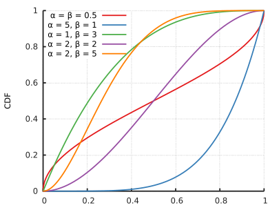
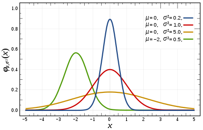
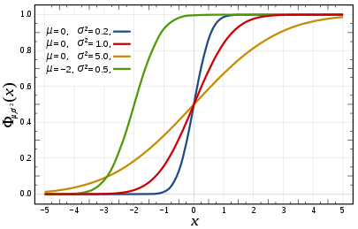
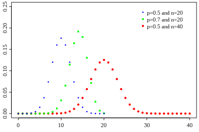
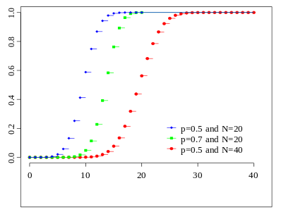

# Week 1:  Motivations and Basics
편집자: Jungduri & gwleeee

----------
## Motivation

인터넷의 등장으로 생긴 방대한 데이터와, 처리 할 수 있는 능력(computation power)의 확보로 데이터와 관련된 여러가지 task를 수행하는 학문

### 대표적인 기계 학습의 tasks
* Documentaton classification(e.g. 스팸 처리)
* Stock market prediction 
* Plate number classification
* Social media recomandation
* Manupulator control

### 머신러닝의 큰 분류
* Supervised learning: **know ture answers**
  * Classification: discrete data에 접근
  * Regression: continuous data에 접근

* Unsupervised learning: **unknow ture answers**
  * Clustering
  * Filtering 

* Reinforcement learning: pass

## Maximum Llikehood Estimation
###  Case study: thumbtask question

### Overview
* 압정으로 내기
* 앞/뒤 어디에 배팅해야 더 승률이 좋을지 아는 것이 목적

### Simple approach

* 5번 던졌더니
  * 앞: 3/5
  * 뒤: 2/5
* 앞에 배팅하는 것이 더 확률이 높음

### Binomial distribution
* 이산적 확률 분포
* iid: 독립적인 이벤트
* 베르누이 시행(Bernoulli trial): 통계학에서 임의의 결과가 '성공' 또는 '실패'의 두 가지 중 하나인 실험을 의미 

* 위의 approach애서 ...  
$P(H) = \theta$  
$P(T) = 1-\theta  \qquad  \because (Bernoulli \; trial)$  
$P(HHTHT) = \theta^3 (1-\theta)^2$  

* Let)
$D = HHTHT$  
$n = 5$  
$k = a_H = 3$  
$p = \theta$  
$\therefore \; P(D| \theta) =\theta^{ a_H} (1-\theta)^a_T$

### Task definition
* Data: head와 tail로 구성된 관측된 데이터
* 가정: 압적의 도박 결과는 theta를 매개변수로 갖는 이산적 확률 분포를 따름
* 목적: 가정을 어떻게 하면 더 강하게 만들 수 있나?
  1. 더 좋은 가정은 만듬
  2. $\theta$ 를 최적화

### Maximum Llikehood Estimation(MLE)
* IDEA: 가정안에서  **관측한 데이터**가 등장할 확률을 최대화
> 가정 = 확률분포 = P
> 관측한 데이터 = observatoin = D
> 실험을 통해 얻어진 observation이 등장하는 확률이 최대가 되는 특정 모델($\hat{\theta}$)을 찾는 것이 목표
* 즉, 아래 수식을 만족하는 $\hat{\theta}$를 찾는 것이 목적  
$$ \hat{\theta} =\argmax\limits_{\theta}P(D|\theta) $$

* 편의를 위해 로그를 적용  
$\hat{\theta} = \argmax\limits_{\theta}P(D|\theta)$  
$\quad = \argmax\limits_{\theta} \{ a_H \ln \theta + a_T \ln (1-\theta) \}$

* minima를 찾기 위해서 derivative  
$\cfrac{d}{d\theta} ( a_H \ln \theta + a_T \ln (1-\theta) ) = 0$  
$\therefore \; \hat{\theta} = \cfrac{a_H}{a_H + a_T}$

* 시행을 더 진행해서 50번을 하였다. 이때 어떤 변화가 생김?
  * Hoeffding's inequality 
$$ P(|\hat{\theta} - \theta^*|  \geq e) \leq 2e^{-2Ne^2}$$ 
  * true값($\theta^*$)과 추정 값 $\hat{\theta}$ 가 오차 범위 안에 들어오는 것은 $N$에 영향을 받음
따라서 시행을 늘리는 것은 에러 bound를 줄이는 효과가 있음

### 베이지안 통계학
- θ에 대한 사전분포 P(θ)는 기존 연구결과에 의해, 상식이나 추측 등에 의해 생성(높은 불확실성을 지닌 분포)된다. 자료를 수집하고 이를 포함하여 새로운 θ의 분포를 만들어가면, 불확실성이 감소되고 분포의 중심도 사전분포의 평균에서 자료의 평균 사이의 값으로 이동한다. 
(사전확률→자료수집→bayes 정리 적용→사후확률 계산→새로운 연구→사전확률→자료수집→…)

| frequentist 통계학                                                                                            | Bayesian 통계학                                                                                                        |
| ------------------------------------------------------------------------------------------------------------- | ---------------------------------------------------------------------------------------------------------------------- |
| 확률은 빈도에 의해 해석 확률을 무한히 많은 시행에서의 상대적 빈도로 정의 p에 대한 보다 구체적 정보 제공 | 확률을 가설에 대한 믿음의 정도로 해석   다수의 가설에 대하여 서로 다른 확률(믿음)을 할당(예에서 가설은 p에 대한 것) |
| 분포에서 모수(예에서 p)는 고정되어 있고 이 분포로부터 다양한 자료가 확률적으로 산출                        | 다수의 가설에 대하여 서로 다른 확률(믿음)을 할당(예에서 가설은 p에 대한 것)                                            |

## Maximum a Posteriori Estimation (MAP)

* *MLE 말고 다른 관점에서* $\hat{\theta}$*를 찾아보자*
* *다시 압정을 던지는 문제로 들어와서.. Bayes는..*
* ***사전정보**를 추가해 보자!*

$$P(\theta|D) = \frac{P(D|\theta)P(\theta)}{P(D)}$$
$$Posterior = \frac{Likelihood \times Prior\,knowledge}{Normalizing\,Constant}$$

* 관측한 데이터가 주어졌을 때, 사후확률은 위와 같은 조건부 확률로 표현 가능
* 이미 관측을 통해 알고 있는 $D$의 확률을 상수 이므로, 사후확률은 아래와 같은 비례 관계로 표현 가능

$$P(\theta|D) \propto P(D|\theta)P(\theta)$$

* 즉, 사후 확률을 크게 만드는 확률 $\theta$를 구하면, 관측한 데이터가 발생한 특정 확률 모델을 알 수 있음
* 확률 변수 $\theta$의 확률 분포를 *Beta distribution* 이라고 가정 하면,
> *Beta distribution* : 0과 1사이에 확률밀도가 양인 연속 확률 분포  
> 

> 
> $$P(\theta)=\frac{\theta^{\alpha-1}{(1-\theta)}^{\beta-1}}{B(\alpha,\beta)}$$
> $$B(\alpha,\beta)=\frac{\Gamma(\alpha)\Gamma(\beta)}{\Gamma(\alpha+\beta)}, \Gamma(\alpha)=(\alpha-1)!$$

* *Beta distribution* 을 가지는 $P(\theta)$를 이용하여 사후 확률 $P(\theta|D)$ 를 정리하면 아래와 같음
$$ P(\theta|D) \propto P(D|\theta)P(\theta) \propto \theta^{a_H}{(1-\theta)}^{a_T} \theta^{\alpha-1}{(1-\theta)}^{\beta-1}$$
$$ = \theta^{a_H + \alpha-1}{(1-\theta)}^{a_T + \beta-1} $$

* 결과적으로, 사후 확률 $P(\theta|D)$ 의 값을 최대로 하는 $\hat{\theta}$는 $log\, MLE$에 의해서 아래와 같이 구해짐

$$ \hat{\theta} = \frac{a_H + \alpha - 1}{a_H + \alpha + a_T + \beta - 2} $$

* 위 수식을 자세히 들여다 보면, 관측 데이터의 양이 많아질수록, $\theta$의 beta distribution을 나타내는 상수 $\alpha, \beta$는 무시할 수 있음 $\rarr$ $MAE$ 와 $MAP$ 값은 같아짐
* 관측한 데이터가 적을때는 MAE와 MAP가 서로 다르기 때문에 주의해야 함
* MAP에서 추가 정보 (e.g. $\alpha,\beta$)를 적절히 이용한다면 유용함

## Distribution

###### Probability Distribution
* 확률분포를 나타내는 P라는 함수는 사건과 사건이 발생할 확률 사이의 1:1 대응 함수  
  $\rarr$ Probability Den Function (확률밀도함수; PDF)
* Cumulative Distribution Function (누적분포함수; CDF) 는 [0,1]의 치역을 가짐  
  $\rarr$ PDF의 정의역에 대하여 적분한 꼴

###### Normal Distribution
 
* mean, variance를 매개변수로 하는 확률분포함수  
  $$f(x;\mu,\sigma)=\frac{1}{\sigma\sqrt{2\pi}}e^{-\frac{x-\mu^2}{2\sigma^2}}$$
  $$Notation:N(\mu,\sigma^2)$$
  $$Mean:\mu$$
  $$Variance:\sigma^2$$
###### Beta Distribution
 
* 정의역의 범위를 [0,1]이고, $\alpha, \beta$를 매개변수로 하는 확률분포
* 확률을 모델링 할 때 매우 좋음  
  $\because$ 확률의 범위가 베타분포의 정의역과 동일
$$B(\theta; \alpha,\beta)=\frac{\theta^{\alpha-1}{(1-\theta)}^{\beta-1}}{B(\alpha,\beta)}$$
$$B(\alpha,\beta)=\frac{\Gamma(\alpha)\Gamma(\beta)}{\Gamma(\alpha+\beta)}$$
$$\Gamma(\alpha)=(\alpha-1)!$$
$$Notation:Beta(\alpha,\beta)$$
$$Mean:\frac{\alpha}{\alpha+\beta}$$
$$Variance:\frac{\alpha\beta}{(\alpha+\beta)^2(\alpha+\beta+1)}$$

###### Binomial Distribution
 
* 사건의 결과가 두가지 경우 밖에 없는 확률 분포
  * (0, 1), (yes, no), (true, false)
* 시행 횟수 n과 사건의 결과가 한쪽일 확률 p를 매개변수로 함
$$f(\theta;n,p)={n \choose k}p^k(1-p)^{n-k}$$
$${n \choose k}=\frac{n!}{k!(n-k)!}$$
$$Notation:B(n,p)$$
$$Mean:np$$
$$Variance:np(1-p)$$
* ${n \choose k}$는 이항계수 이며 n개 중 k개를 고르는 경우의 수를 의미 함
  * 중학생 때 배운 $_nC_k$
* Binomial Distribution의 특수한 사례로 Bernoulli Distribution이 있음
  * 시행회수 n이 1로 제한 되며, 사건의 결과는 (0,1)
###### Multinomial Distribution
* 사건의 결과, 즉 선택지가 여러가지인 경우의 이산 확률 분포
* 시행 횟수 n과 각 선택지에 대한 확률 $p_i$를 매개변수로 함
$$f(x_1,...,x_k;n,p_1,...,p_k)=\frac{n!}{x_1!..._k!}p_1^{x_1}...p_k^{x_k}$$
$$Notation:Mult(P), P=<p_1,...,p_k>$$
$$Mean:E(x_i)=np_i$$
$$Variance:Var(x_i)=np_i(1-p_i)$$

----
### References
* https://m.blog.naver.com/bsj104/221658918933