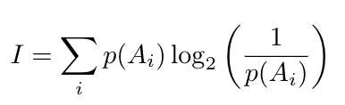
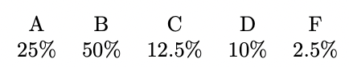
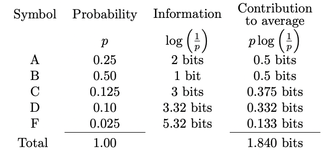
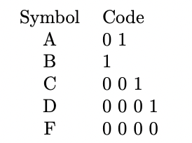
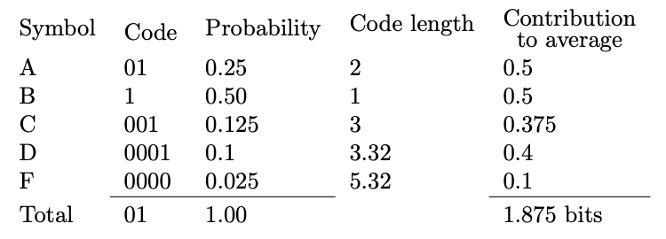

## Entropy 간단 설명

  

통계학적 관점에서 엔트로피는?

-   확률변수(심볼)들이 존재하고, 각 심볼들의 발생 확률(확률 분포)이 존재하는 경우 확률변수가 가지는 정보량

  

간단히 생각해서,

-   예측하기 쉬운 확률변수 → 정보량이 적음
-   예측하기 어려운 확률변수 → 정보량이 많음

  

엔트로피는,

확률변수가 가지는 정보량의 **하한**

  

  

-   즉, 확률모델이 존재할 때, 특정 확률변수는 엔트로피 이하의 정보로 표현 불가능  
    
-   예를 들어, equally distribution의 심볼을 네개 가지는 확률변수 X의 경우  
      
    $$H(X) = - { P(x_1)log(x_1) + P(x_2)log(x_2) + P(x_3)log(x_3) + P(x_4)log(x_4) } $$
      
    우리는 비트단위의 정보를 사용하기 때문에 밑이 2인 log로 가정을 한다면,  
      
    $$ = - { 0.5 * (-1) + 0.5 * (-1) + 0.5 * (-1) + 0.5 * (-1) } = 2 $$
      
    따라서 평균 정보량은 2(bits), 즉 각 심볼들 $(x_1 ~ x_4)$은 00, 01, 10, 11로 표현 가능 하지만 확률변수의 확률분포가 달라지면 이야기가 달라짐

  

##### 확률 분포가 다르다면?

  

-   위와 같은 학점 분포가 존재할 때, 각 심볼들의 확률과 정보량을 이용하여 엔트로피를 계산하면

  

-   1.840 bits가 나옴. 즉 이는 학점 분포에 대한 데이터를 표현할때 최소한으로 사용할 수 있는 평균 정보량임

-   위 확률 분포에 대해서 Huffman coding을 진행하여 심볼에 코드를 부여

  

-   발생 확률이 높은 심볼 B의 경우 가장 적은 비트로 표현이 가능
-   반면 발생 확률이 낮은 D, F 심볼은 많은 비트로 표현 가능

-   Huffman coding 결과의 정보량을 계산해 보면?

  

-   위 표에서 contibution to average에 표기된 비트량은, 각 심볼의 비트수와 확률을 곱한 값임

-   위 표에서 code length는 확률 관점에서의 정보량임 $\log{(1/p)}$

-   평균 정보량은 1.875bits로 엔트로피에 매우 근접함을 알 수 있음

  
