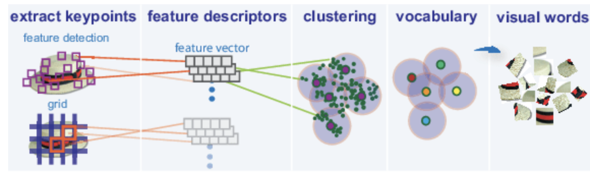
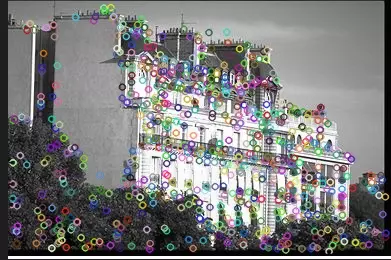
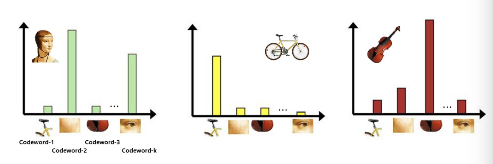
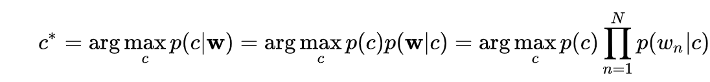

# Bag Of Features

- Bag Of Words와 연관이 있는 것은 아닌, 영감을 받아 이름이 지어진 것
- Bag Of Words 는 문서 검색을 위해 단어의 위치는 고려하지 않고 모든 문서를 bag of words 로 간주함. 이에 영감을 받아 Visual Words 혹은 Features 라는 형태로 image 를 BOW 와 유사하게 representation 을 하는 것.

### Image representation based on the BoW model

1. Feature Extraction and Clustering

	- 먼저 영상에서 feature 들을 추출(using SIFT)
		- SIFT
			- 이미지 크기와 회전에 불변하는 특징을 추출하는 알고리즘
			- 이미지 내에서 위와 같은 환경 변화에 강인한 부분, edge 부분을 찾아 feature로써 추출함
			
			
	- 추출된 feature 들을 가지고 clustering 을 수행하여 cluster center 인 codeword 를 찾아냄 
	
2. Codebook generation
	- feature 들을 대표할 수 있는 값(code) 들로 구성되는 codebook 생성
	- 일종의 dictionary 로 모든 종류의 feature 가 포함된 것이 아니라 주요하다고 생각되는 feature 들만 담는것임. (using k-means clustering)
		- 여기서 추출된 center == codeword
	- 이 codebook 을 몇개의 codeword로 구성할지는 hyperparams 로써 주어짐
		- 몇개의 cluster 로 군집화 시킬지에 따라 몇개의 codeword로 구성될지가 달라지는 것

3. Image Representation
	- 각각의 이미지들을 codeword들의 histogram 으로 표현함
	- image 하나당 하나의 histogram이 나오며 이 히스토그램의 크기(bin)는 codebook의 크기(codeword들의 개수)와 동일하다.
		- 한 이미지의 feature 가 codeword-N과 가장 유사하면 codeword-N의 bin을 하나 채운다는 것
	
	- 이 Histogram 이 2D Image 를 표현하는 1D Vector 가 되는 것임. (== Feature Vector)

4. Learning and Recognition
	- **Learning**
		- Unsupervised Learning 인 Naive Bayes 확률을 이용한 방법
			- class 별 histogram 값을 확률로서 해석하여 물체를 분류
			- 
		- Supervised Learning 인 SVM 과 같은 Classifier 을 이용한 방법
			- 1D vector 로 표현된 Histogram 값을 feature vector로 보고 SVM 에 넣어 decision boundary 를 추출해냄.
			- 이를 통해 학습 데이터 간의 decision boundary 를 찾게 된다면 test scene의 class 도 분류할 수 있게 될 것임.
	- **Recognition**
		- Test Image 의 feature 추출 (using SIFT)
		- Train dataset 으로 생성된 Codebook 과 Test Feature 들을 비교해 Histogram 생성(가장 유사한 Image 에 bin을 가장 높게)
		-  Test Data의 Histogram 을 이용해 SVM 이나 Naive Bayes 에 넣어 가장 확률이 높은 class 를 추출해 냄

참고자료 [link1](https://en.wikipedia.org/wiki/Bag-of-words_model_in_computer_vision)
[link2](https://ai.stackexchange.com/questions/21914/what-are-bag-of-features-in-computer-vision)
[link3](https://darkpgmr.tistory.com/125)
[link4](https://kr.mathworks.com/help/vision/ug/image-classification-with-bag-of-visual-words.html)
[link5](https://mingtory.tistory.com/88)

실습자료 https://github.com/maponti/imageprocessing_course_icmc
