# Activation function

## Sigmoid

### Logit
이진 클래스 구분 문제(성공 or 실패)에서,
성공 확률 p를 이용하여 $Odds$를 다음과 같이 정의

$$ Odds = \frac{p}{1-p} $$

$Odds$에 자연로그를 취하면 $Logit$이 됨

$$ Logit = \ln{\frac{p}{1-p}} $$

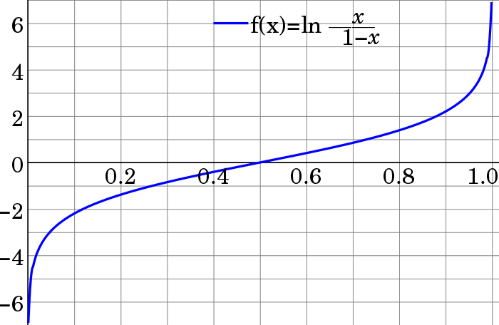

$Logit$은 확률 $p$를 변수로 하는 함수이므로 $[0, 1]$ 구간에서 정의 되며, $[-\infty, \infty]$ 의 치역을 가짐

**Logit은 어떠한 경우에 사용할까?**
	- Logistic Sigmoid를 유도할 때?
	- NN에서 확률로 추정된 출력을 수치화 할때 사용

### Logistic Sigmoid (a.k.a Sigmoid)

**Logit과 Sigmoid는 역의 관계**

Logit 함수에 대해 역함수를 구해보면,

$$ Logit = \ln{\frac{p}{1-p}} = f^{-1}(p) $$

$p$에 대해서 정리,

$$ e^{f^{-1}(p)} = \frac{p}{1-p}, \quad p(1+e^{f^{-1}(p)})=e^{f^{-1}(p)} $$
$$ p = \frac{1}{1+e^{-f^{-1}(p)}} $$

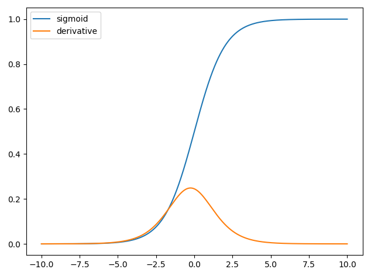

따라서 Logistic Sigmoid는 $f(x)=\frac{1}{1+e^{-x}}$ 로 정의 가능함

Logistic Sigmoid는 Logit과 정 반대로, $[-\infty, \infty]$의 정의역과 $[0, 1]$ 치역을 가짐

**Logistic Sigmoid의 특성**
- 부드러운 커브 -> 미분값이 튀지 않는다
	- 이는 NN에서 Gradient Exploding을 방지함
- 출력값 0.5를 기준으로 이진 분류가 가능
	- 강의에서 설명하듯 이진 분류 문제에서 조건부 확률밀도 함수를 S자형 곡선으로 표현시 적합
- Sigmoid 함수는 입력 값이 0에 가까울때 민감하게 반응하고, 대부분의 출력은 1과 0으로 포화됨
	- 포화 범위가 넓기 때문에 기울기 기반 학습이 어려움
	- 포화가 된다는 것은 gradient 값이 0에 가까워 진다는 것, 즉 Vanishing gradient 발생
- NN에서 히든 레이어의 활성화 함수로 사용은 부적합
- NN에서 출력 레이어 에서 이진 분류를 위한 장치로 활용 (classification 문제)

### Tanh
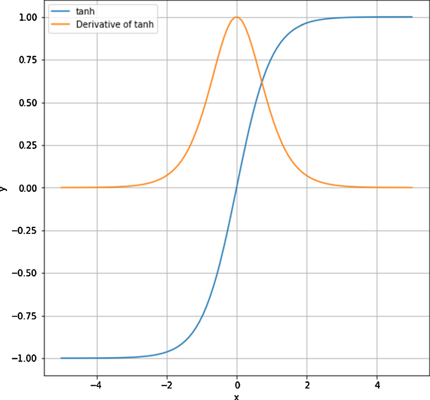

$$ tanh(x) = 2\sigma(2x) - 1 $$
$$ tanh(x) = \frac{e^x - e^{-x}}{e^x + e^{-x}} $$

Logistic Sigmoid $(\sigma)$를 변형하여 만든 함수

Logistic Sigmoid와 큰 차이점은, 치역의 범위가 [-1, 1]로 정의되고, 중앙값이 0

**Tanh의 특성**
- tanh는 입력이 0인 부근에서는 선형 함수와 비슷하게 작동 (입력 0부근에서 미분값이 1로 수렴)
	- 따라서 NN에서 히든 레이어의 출력이 작다는 보장이 있다면, tanh를 활성화 함수로 사용 가능
- 하지만 vanishing gradient는 여전히 존재

### Sigmoid를 사용하는 특수한 경우

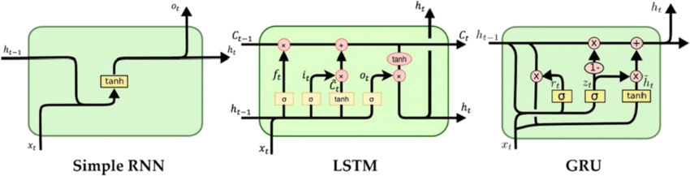

LSTM과 GRU(Gated Recurrent Unit) 레이어에서 주로 사용

두 레이어의 경우, 이전 step의 값을 가져와서 반복적으로 사용하므로 값을 normalize 하는 과정 필요
(다른 activation function을 사용한다면, step이 진행될수록 값이 커지는 결과를 가져옴)

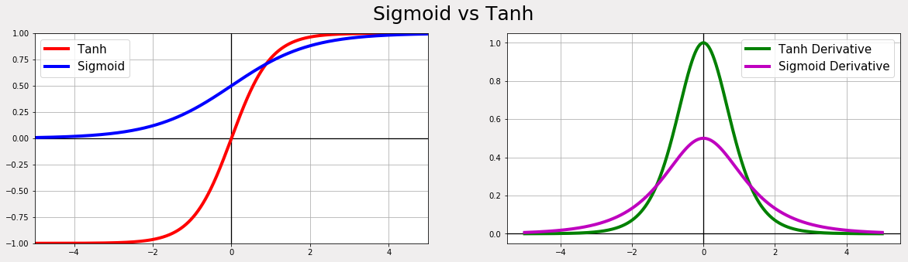
tanh의 미분값의 범위가 더 큼 (0, 1)
Logistic sigmoid 보다 기울기 역전파가 잘 되는 tanh를 사용

## Softmax

Logistic sigmoid의 일반화
- Logistic sigmoid를 이용하여 Softmax를 유도하는 과정은 [1]에 잘 설명돼 있음
	- 해당 자료를 참고하면 왜 $e^x$를 사용하여 softmax를 표현하는지 알 수 있음

가능한 값이 n가지인 이산 변수(n classes)에 관한 확률 분포를 표현
n개의 클래스 중 k번 째 클래스의 softmax 함수 $y_k$는 아래와 같이 정의

$$ y_k = \frac{e^{a_k}}{\sum_{i=1}^{n} e^{a_i}} $$

$$ \approx \frac{k번 째 클래스일 확률}{전체 확률} $$

softmax의 특성
- 지수 함수 -> 입력 인자들의 대소관계는 변하지 않음
- 지수 함수 -> 입력 인자들 사이의 작은 값의 차이를 확실히 구분 가능
- 미분이 편함

### Softmax에 적합한 loss function
NN에서 주로 n개의 클래스를 가지는 classification, segmentation 문제에서는 출력층에 softmax를 사용함

잠깐 Week 2로 돌아가서, Entropy에 대해 잠시 복습해 보면, 
entropy는 특정 확률 분포에 대한 불확실성을 나타 냄

확률 분포 X가 있을 때,

$$ H(X) = \sum_{i} P(x_i)\log{\frac{1}{P(x_i)}} $$

Entropy는 위와 같이 정의 되며, 각 심볼 $(x_i)$의 발생 확률과 발생 확률이 가지는 정보량 $\log{\frac{1}{P(x_i)}}$ 의 곱으로 표현 됨

#### Cross-Entropy loss

Loss function의 한 종류인 Cross-Entropy loss는 두 확률 분포의 차이를 구하기 위해서 사용

$$ H_p(q) = \sum_{i} q(x_i)\log{\frac{1}{p(x_i)}} $$

q는 실제 확률 분포 (정답 데이터; GT), p는 예측한 확률 분포

여기서, Cross-Entropy $H_p(q)$를 최소화 한다는 것은, 예측한 확률 분포 p를 실제 확률 분포 q에 fit 시켜 q에 대한 entropy로 $H_p(q)$를 수렴 시킨다는 것을 의미

- 일반적인 classification 문제에서는, 출력 vector를 Softmax를 이용하여 확률 분포로 만들고, Cross-Entropy loss를 적용하여 정답 레이블과 일치 시킴
- 일반적인 image segmentation 문제에서는, C 채널을 가지는 출력 feature map의 각 화소 위치에 대하여 channel 뱡향의 vector에 대하여 Softmax를 적용, Cross-Entropy loss를 적용하여 정답 레이블과 일치시킴 

## ReLU
Rectified Linear Unit (직역하자면 정류 선형 단위)

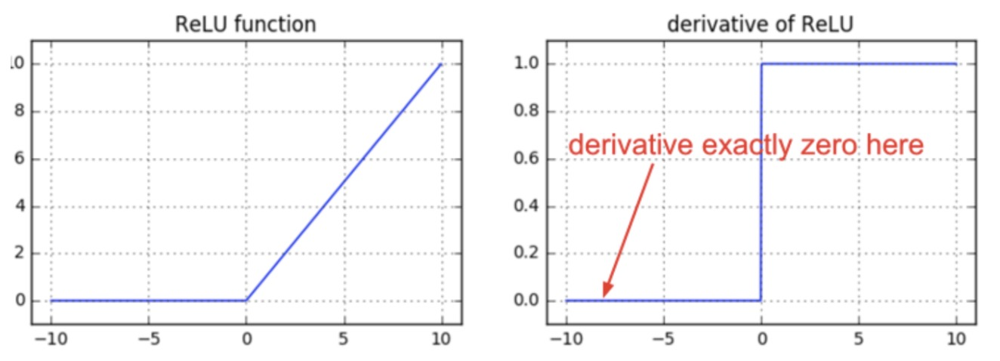

+신호는 bypass, -신호는 차단

$$ h(x) = \begin{cases}
x, & (x>0) \\
0, & (x<=0)
\end{cases} $$

특징
- 출력 값의 범위가 넓음 (양수) -> Vanishing gradient 문제 발생 X -> NN의 히든 유닛에서 주로 사용
- 다른 activation funtion 들에 비해 속도 빠름 (너무 단순하니까, 기울기 0 or 1)
- 미분 불가능한 지점 (x=0)에 대한 맹점 존재 -> 입력값이 0일 확률이 적어 무시
- 음수의 입력에서는 0을 출력
	- 특정 뉴런이 죽는 현상을 초래할 수 있음 (Dying ReLU)

### 파생 ReLU
ReLU의 단점을 극복하기 위한 다양한 activation function 들이 존재

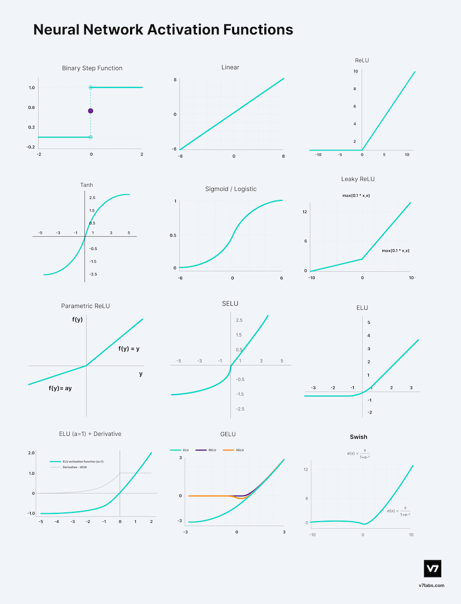

Leaky ReLU, Parametric ReLU, SeLU, GeLU, ELU, Mish, Swish, ...

"종류가 너무 많아"

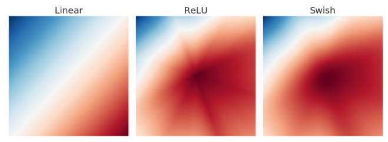
위 그림은 특정 NN 모델에 대한 activation map을 보여줌
ReLU의 경우 갑작스런 값의 변화를 수반하기 때문에, activation map에 사진과 같이 불연속적인 경계가 생기나,
이런 단점을 극복한 function인 swish의 경우에는, 매우 연속적인 activation map 분포를 보여 줌

## Activation function 성능 평가

최신 activation function에 대한 survey 논문[2]을 보면, 수 많은 activation function이 소개돼 있고, 가장 대중적인 function들에 대해 일정한 조건하에 벤치마킹을 수행 함

### CIFAR100 데이터셋, classification 학습 결과
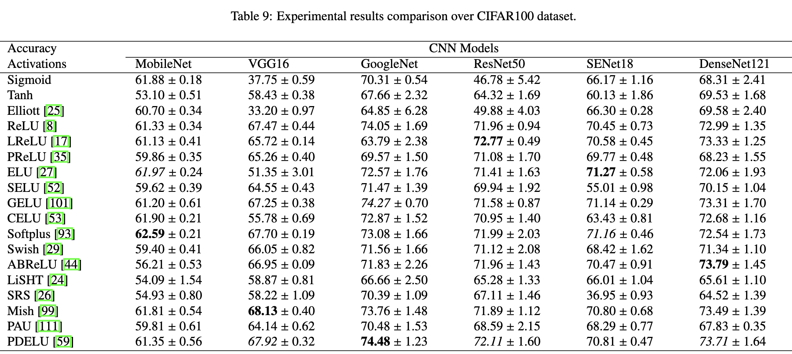
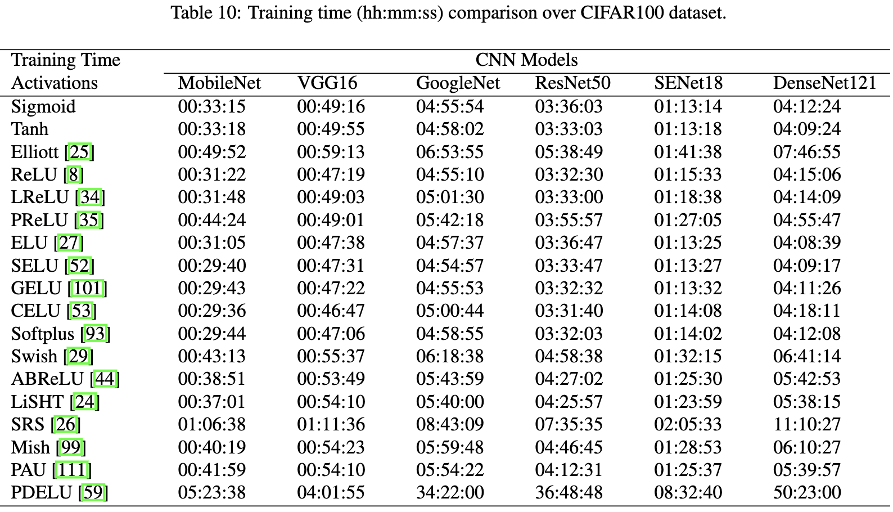

위 벤치마크를 보고, Backbone의 종류에 따라 적합한 activation function을 취사선택 하는것도 좋은 방법이라고 생각 함

## Reference
[1] https://gooopy.tistory.com/53?category=824281

[2] https://arxiv.org/abs/2109.14545

## +@ Weight initialization
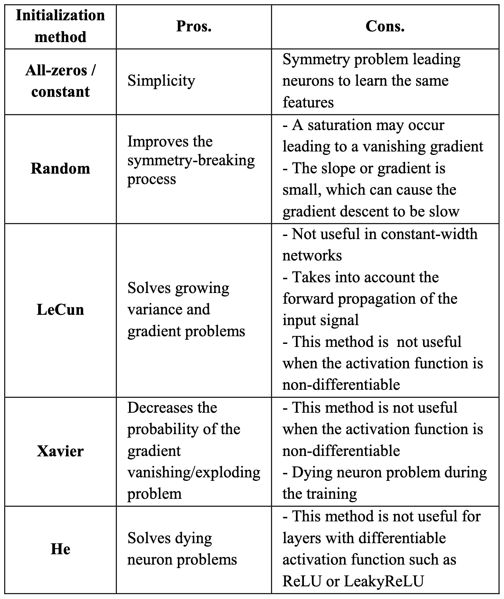
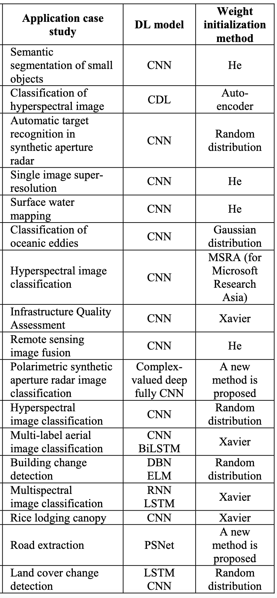

**추가 정보**
- torch의 기본 weight initialize method -> **kaiming uniform**
- Activation function에 따른 weight initializer 선택
	- Sigmoid/tanh -> Xavier initializer
	- ReLU -> He initializer