# Optimizer

## Gradient Descent의 문제점
- 느린 학습 속도 : 한번 학습에 모든 데이터셋을 사용 (BGD)
- 비효율적인 update : step size (또는 learning rate)를 적용하지 않아 최적값 수렴이 어려움
- Local Minima : 진짜 최적값에 도달하지 못하고, Gradient가 발생하지 않는 위치에 머물수도

## Various Optimizer 
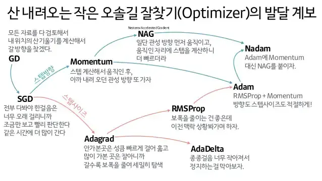
- 추가로 AdamW, SparseAdam, Adamax, ASDG, LBFGS, Radam

### BGD -> SGD, Mini-batch GD
- 전체 데이터 셋 대신 일부만 봄
    - local minia 피할 가능성이 높아짐
    - 일부 데이터만 보는것은 오히려 수렴을 방해할 수도 있음

### Momentum
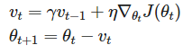
- J(θ) = loss function
- 이전 gradient를 반영(=관성)시켜서 gradient가 0에 수렴되지 않도록 유도함
- 이전 gradient 반영 비율은 급격하게 줄어듦

### Adagrad
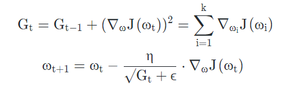
- Adaptive + grad, 상황에 맞게 변화하는 gradient
- 업데이트 빈도가 높은 파라미터는 $G_{t}+\epsilon$ 이라는 분모에 의해 조금씩만 변화하도록 유도
    - 업데이트가 누적될수록 학습이 더이상 안되는 파라미터가 생김

### RMSProp
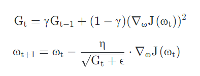
- $G_t$ 계산에 지수이동평균을 적용하여 Adagrad의 아이디어는 유지하되, 학습이 멈추는 문제를 방지
- 이번 스탭의 loss function 미분값에 제곱을 하여 $G_t$ 값 반영 비율을 조정 및 무한히 커지지 않도록 함
- γ => decaying factor, forgetting factor

### Adadelta (Adaptive Delta)
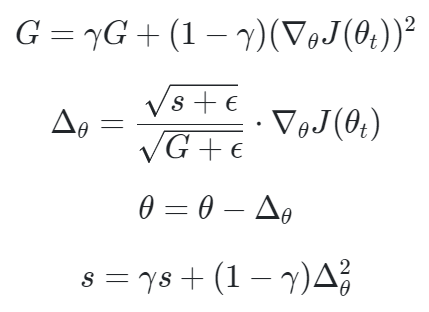
-  이론적으로는 first-order optimization가 아닌 Second-order optimization를 추정하려는 목적
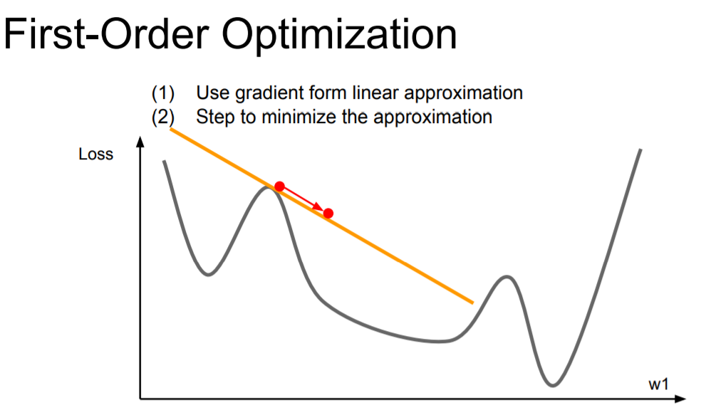 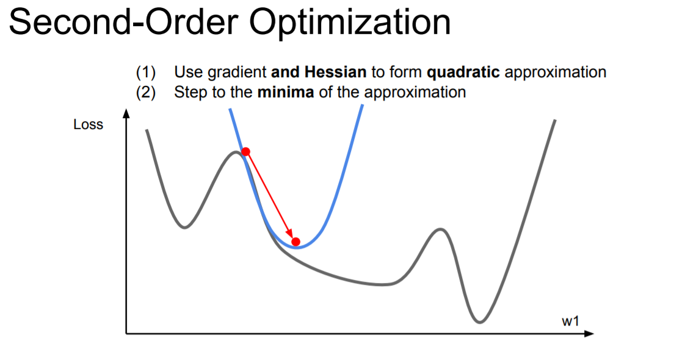
- Second-Order Optimization 결론적으로는 학습이 멈추는 문제를 방지하여, RMSProp와 유사한 결과를 달성함

### Adam
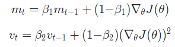
- RMSProp + Momentum
    - 기울기의 제곱값 지수평균을 저장 (= RMSProp, 1차 모멘트(평균) 추정량)
    - 기울기의 지수평균을 저장 (Momentum, 2차 모멘트(분산) 추정량)

    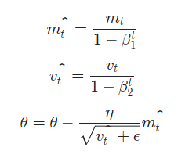
    - 학습 초반에 $m_t$와 $v_t$ 가 0으로 초기화 되어 있으므로, 0에 가깝게 bias 되어 있는 것을 위의 식을 통해 해소함

### Nesterov accelerated gradient(NAG)
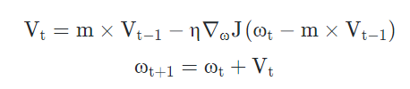
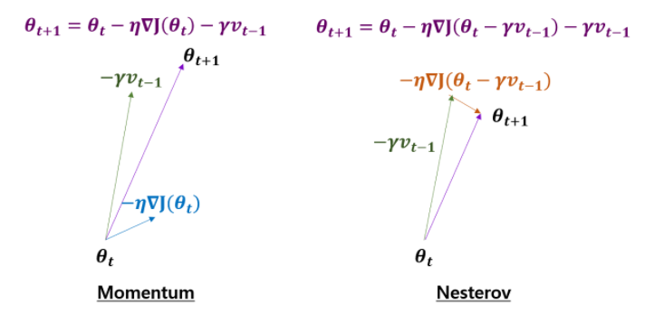
- Momentum이 현재 기울기 적용하여 이동 -> 그동안의 모멘텀 적용하여 이동
- NAG는 그동안의 모멘텀 적용하여 이동 -> 이동된 위치에서의 기울기 적용

### SparseAdam
- 대부분의 입력이 0인 tensor에 대해 효율을 높이기 위해 모멘텀이 발생한 파라미터에 대해서만 gradient를 업데이트 하는 adam various

### Nadam
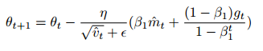
* Adam + NAG
* Adam의 현재 Momentum 대신에 이동후의 momentum을 적용

