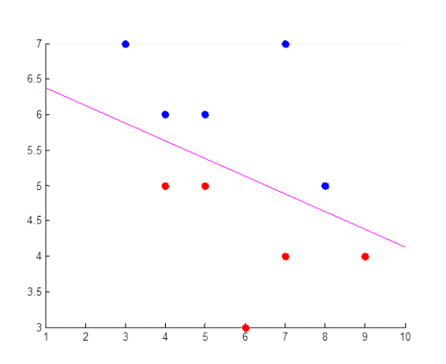

# Kernel Function
---
Date: 22. 8. 5
Writer: gwleeee

#### 데이터 분류

- 우리는 SVM을 통하여 linearly separable 한 데이터의 분류를 수행함

- 하지만 위와 같은 데이터들을 SVM을 통해서 잘 분류할 수 있을까?
	- Soft margin을 생각하더라도, 선형적으로 분류가 불가능 함

 
- linear하게 분류가 안되는 데이터를 위 그림과 같이 높은차원으로 보낸다면 ..?
	- 모종의 mapping function을 이용하여 input space의 차원을 feature space로 변환
	- linear boundary를 찾을 수 있다!
- 데이터의 차원이 높아질수록 lineary separable 할 확률이 높아짐
	- 실제로 고차원의 random vector의 경우, 서로 웬만하면 orthogonal함

#### 문제 발생
- mapping function을 통해 얻어지는 이점은, 고차원 영역에서 분석하고자 하는 데이터의 분류가 쉽다는 것
- 하지만 데이터의 차원이 높아지면 계산량은 제곱으로 커지게 됨

#### 이 문제를 어떤 꼼수로 해결해야 할까?
- 특정 mapping function과 equivalent하며, input space의 데이터만으로 계산이 가능한 function이 존재 한다면 ..?!

###### SVM 문제로 돌아와서..

- KKT condition 하의 lagrange prime function과 largange multiplier를 이용한 svm의 비용함수에서
	- dual problem을 해결하면, 비용함수 $L$ 은 수식 맨 아랫줄과 같이 $\alpha$ 에 대한 함수로 표현 가능
	- 여기서 given인 $x_i, x_j$ 는 입력 데이터이며, input space의 차원의 vector
		- 두 벡터의 곱은 내적으로 계산 가능
		- linearly unseparable한 데이터의 classification을 위하여 데이터 $x$의 차원을 상승시키면 -> 내적 계산에 필요한 연산량이 무지하게 커짐
- 내적 연산의 결과는 scalar
	- 어차피 결과값이 상수인데.. $x_i, x_j$ 를 변수로 하는 함수로 고차원에서의 내적 결과를 구현할 수 없을까? -> 이런 함수를 kernel 함수라고 정의하자!

##### Kernel function

- 대표적으로 사용되는 kernel function들

- **polynomial kernel function이 어떻게 mapping function과 동치관계일까?**

		- 3차원의 데이터가 있을때, 위와 같은 mapping function $\Phi(x)$ 를 이용하여 9차원으로 만들었을 때,
		- 두 mapping function의 내적은 x, y의 내적의 제곱과 동치 관계
		- 결과적으로, **내적한 결과 스칼라를 제곱** 했을 뿐인데.. **9차원에서의 계산 효과**를 보여 줌
- **Radial Basis Function(RBF)이 어떻게 mapping function과 동치관계일까?**
	- RBF의 kernel function의 mapping 차원은 무한대라고 함. 왜?
	- RBF의 매핑 함수를 유도 하면
	$$e^{-\gamma(x_i-x_j)^2} = e^{-\gamma(x_i^2+x_j^2)}e^{\gamma(2x_ix_j)}$$
	$$=e^{-\gamma(x_i^2+x_j^2)}(1+\frac{2\gamma}{1!}x_ix_j+\frac{(2\gamma)^2}{2!}(x_ix_j)^2+\frac{(2\gamma)^3}{3!}(x_ix_j)^3+...)$$$$=e^{-\gamma(x_i^2+x_j^2)}(1\cdot1+\sqrt\frac{2\gamma}{1!}x_i\cdot\sqrt\frac{2\gamma}{1!}x_j+\sqrt\frac{(2\gamma)^2}{2!}(x_i)^2\cdot\sqrt\frac{(2\gamma)^2}{2!}(x_j)^2+...)$$
	$$=e^{-\gamma x_i^2}\left(1,\sqrt\frac{2\gamma}{1!}x_i,\sqrt\frac{(2\gamma)^2}{2!}(x_i)^2,...\right) \bullet e^{-\gamma x_j^2}\left(1,\sqrt\frac{2\gamma}{1!}x_j,\sqrt\frac{(2\gamma)^2}{2!}(x_j)^2,...\right)$$
$$=\Phi(x_i)^T\Phi(x_j)$$
		- 이렇게 RBF kernel function을 전개하면, 두 벡터의 내적으로 표현 가능하고, 각 벡터는 무한 차원으로의 mapping function
		- 단순히 **가우시한 함수꼴의 지수함수를 계산**했을 뿐인데, **무한차원**으로 확장한 공간에서의 내적값 스칼라를 얻을 수 있음
		- 수식을 보았을 때 RBF에서는 $\gamma$ 파라미터에 따라, 고차원 성분을 얼마나 유지하는지 결정 됨
			- $\gamma$ 가 큰 값을 가지면 고차원 성분의 비중이 커져, 복잡한 데이터도 분리 가능하도록 매핑이 가능

##### Kernel function의 성립 조건?

- Kernel에 대응하는 mapping function $\Phi$ 가 존재하기 위해서는 Mercer's Theorem의 조건을 만족해야 함
	- Scalar를 출력하는 continuous function
	- positive semi-definite operator (대각 성분이 양수)
	- Kernel matrix는 symmetric matrix 이며, orthonormal한 basis로 구성
- 위에서 소개된 kernel function 들은 Mercer's Thorem을 만족

##### 다시 SVM 문제로 돌아와서...

- 최적의  $\alpha$ 계산을 위한 목적함수에서 입력데이터 $x_i, x_j$ 에 mapping function $\Phi$ 를 적용하고

- 두 mapping function의 곱을 kernel function으로 대체하고, KKT 컨디션을 고려하여 $\alpha$ 를 계산 -> **이것이 Kernel Trick**

- 계산된 $\alpha$를 이용하여 w와 b를 계산할 때도.. 여전히 kernerl trick 사용 가능!

- classification을 위한 wx+b 에서도, x를 mapping function을 통해 고차원으로 보내야 하기 때문에, 결국 kernerl function을 사용할 수 있는 내적의 꼴로 표현 됨
- 결과적으로  부호 판별을 통하여 wx+b의 부포 판별을 통하여 boundary 결정

#### Kernel trick을 이용하여 linearly inseparable 데이터의 분류
