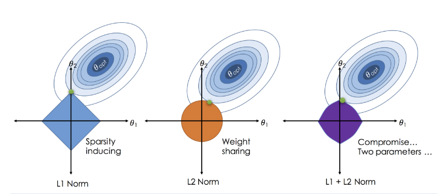

### 선형회귀 (Linear Regrssion)
: 선형 회귀는 특징의 개수에 따라 다음 두 가지로 나눌 수 있다. 
- 단순 선형 회귀 (simple)
	- $\hat{y}=w_0x_0+b$
- 다중 선형 회귀 (multiple)
	- $\hat{y}=w_0x_0+w_1x_1+...+w_nx_n+b$

### 최적의 $w,b$
- MSE(평균제곱오차)를 최소화하여 최적의 $w,b$를 찾을 수 있다.
- $MSE=\frac{1}{n}\sum{(y-\hat y)}^2$
- $argmin_{w,b}\frac{1}{n}\sum{(y-\hat y)}^2$
- 하지만, 위를 통해서 최적의 $w,b$를 찾을때, 필요이상으로 데이터의 경향을 따라가게 되면, overfitting이 생길 수 있고, 이를 해결하기 위한 방법에는 Lasso와 Ridge가 있다.

### Lasso Regrssion
(Least Absolute Shrinkage and Selection Operator)
: 가중치의 절대값의 합이 최소가 되는 방향으로 MSE가 최소가 될 수 있도록 하는 방법.
- 따라서, 가중치의 모든 원소가 0이 되거나 0에 가깝다는 방향으로 가야하고, 그에 기초해L-1-norm의 특징을 가진다.
- 목적함수, 제약조건: 
	-  $\hat\beta=argmin_\beta(y=X\beta)^T(y-X\beta), s.t.||\beta||<t$
		= $argmin_\beta\{\sum{(y_i-x_i\beta)^2}+\lambda\sum|\beta_j|\}$
- lasso식은 L1-norm은 미분이 불가능하기 때문에 closed from solution 불가능
	- Neumerical optimization methods
		- Quardratic programming techniques
		- LARS algorithm
		- coordinate descent algorithm
- $\lambda$가 0이면 일반 least square랑 같아지고, $\lambda$가 무한히 커지면 constant $\hat{y}$(underfitting)를 가지게 된다
- 장점: 
	- 1. 적절한 $\lambda$를 통해서 일반화된 모델을 찾을 수 있다 (cross validation)
	- 2. subset selection 효과
		: 덜 중요한 특징의 가중치를 0으로 만들어 제거함으로써 sparse model을 만들수 있다

### Ridge
: Lasso의 L1-norm penalty대신에 L2-norm penalty사용
- MSE + penalty = MSE + $\alpha$L1-norm $=\frac{1}{n}\sum{(y-\hat y)}^2+\lambda\sum{||w||}$
- 미분이 가능하기 때문에 closed from solution이 있다.

### Lasso와 Ridge

- 왼쪽: Lasso, 오른쪽: Ridge, 파란색: 각 제약 조건, 빨강색: RSS, $\hat \beta$: 최소 제곱이 되는 지점
- Lasso는 접점에서 계수가 0으로 추정하는 경우가 생긴다.
- Ridge는 0에 가깝지만 0은 될 수 없다.
- 즉, 데이터의 변수가 모두 중요한 경우에는 Ridge를, 일부 변수가 중요할 경우에는 Lasso를 선택하면 좋다.

### Elastic-Net Regression
: Ridge와 Lasso를 합한 형태
- $\hat\beta=argmin_\beta(y-X\beta)^T(y-X\beta),  s.t.\alpha|\beta|+(1-\alpha)||\beta||$
- $\alpha$가 0에 가까울수록 Rigde의 특성을 1에 가까울 수록 Lasso의 특성을 가짐으로써, 중요한 변수들에 대해 모두 중요하게 취급하고, 중요하지 않은 경우에도 모두 공평하게 중요하지 않게 취급한다. (상관관계가 높은 변수들을 동시에 선택)

- Elastic의 penalty 함수는 가장 오른쪽의 그림과 같다.

### 그외의 Regularization
- 인접한 변수들을 동시에 선택하는 Fused Lasso
- 사용자가 정의한 그룹 단위로 변수를 선택하는 Group Lasso
- 사용자가 정의한 그래프의 연결관계에 따라 변수를 선택하는 Grace